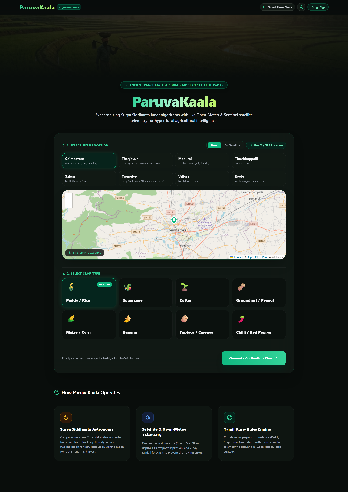
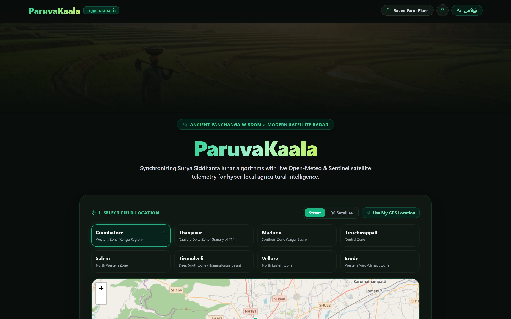
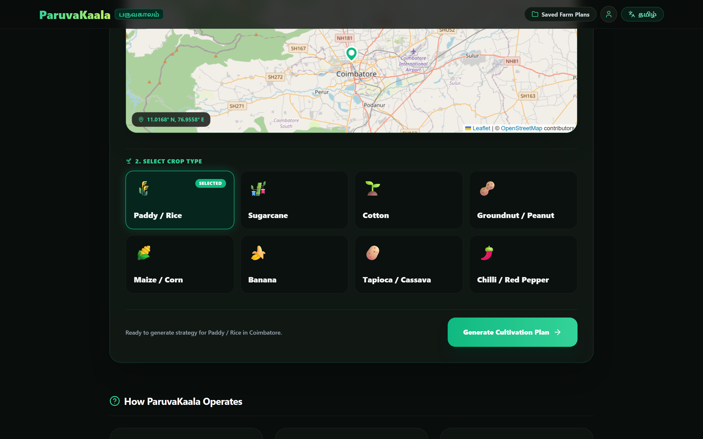
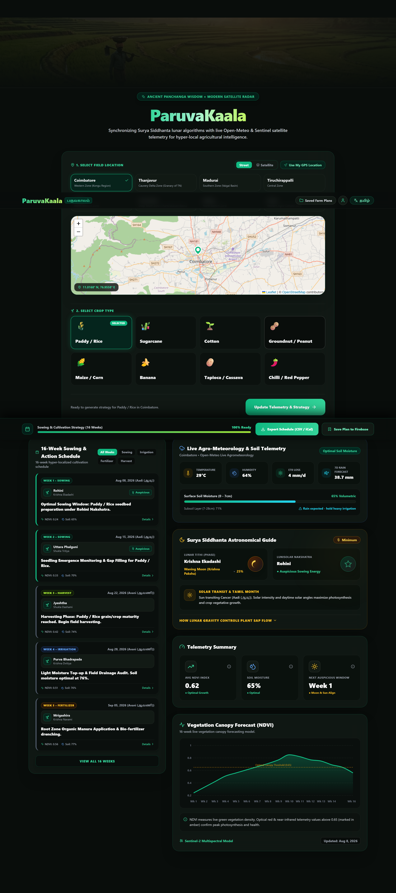

# ParuvaKaala | பருவகாலம் 🌾

**ParuvaKaala** ("Seasonal Time" in Tamil) is a production-ready, offline-capable Progressive Web App (PWA) deployable to **Firebase Hosting**. It fuses **Ancient Vedic Panchanga Wisdom** with **Modern Earth Observation Data** to provide actionable, hyper-local farming intelligence ("When to sow, irrigate, fertilize, prune, harvest, and protect").

---

## 🎬 Promotional Video & Platform Preview

<div align="center">
  <video src="ParuvaKaala-PromotionalVideo.mp4" controls width="100%" poster="public/farm_banner.png">
    Your browser does not support the video tag. <a href="ParuvaKaala-PromotionalVideo.mp4">Click here to watch ParuvaKaala Promotional Video</a>.
  </video>
</div>

### 📸 Product Gallery
| Full Page Dashboard | Interactive Field Map |
| :---: | :---: |
|  |  |

| Crop Selection | Telemetry & Astronomy Cards |
| :---: | :---: |
|  |  |

---

## 🌟 Key Features

- **Hyper-Localized Earth & Sky Telemetry**: Interactive **Leaflet map** with OpenStreetMap and **Esri World Imagery Satellite overlays**, GPS geolocation button, and 8 Tamil Nadu agro-district presets.
- **Offline Astronomical Panchanga Engine**: Powered by `astronomy-engine` for 100% offline, deterministic calculations of **Tithi** (1–30), **Nakshatra** (1–27), **Yoga** (1–27), **Karana**, **Lahiri Ayanamsa**, **Solar Transits (Rasi)**, **Moon Phase %**, and plant **Sap Flow Dynamics**.
- **Real-Time Agrometeorology (Open-Meteo API)**: Live soil moisture at 0–7cm & 7–28cm depths, ET0 evapotranspiration (mm/day), surface temperature, relative humidity, and 7-day rainfall forecasts with resilient fallback models.
- **Crop Intelligence Engine**: Supports 8 regional crops (**Paddy / நெல், Sugarcane / கரும்பு, Cotton / பருத்தி, Groundnut / நிலக்கடலை, Maize / சோளம், Banana / வாழை, Tapioca / மரவள்ளி, Chilli / மிளகாய்**) with crop-specific growth curves and water sensitivity.
- **16-Week Action Schedule & Telemetry**: Dynamic weekly tasks, NDVI vegetation canopy forecasting area chart (Recharts), auspicious sowing windows, category filters, and detailed explanation drawers.
- **Bilingual Interface**: Native, seamless toggle between **English (`en`)** and **Tamil (`ta`)** across all UI labels, astronomical explanations, and weather telemetry.
- **Firebase Web SDK v10+ Cloud Sync**: Anonymous authentication and Firestore database persistence for saving cultivation strategies to the cloud.
- **Offline Progressive Web App (PWA)**: Built with `vite-plugin-pwa` for offline service worker caching and home-screen installation.
- **Data Export**: Export complete 16-week schedules to **CSV** or sync with calendar feeds.

---

## 🛠️ Tech Stack & Architecture

- **Frontend Framework**: [React 18](https://react.dev/) + [TypeScript](https://www.typescriptlang.org/) + [Vite](https://vitejs.dev/)
- **Styling & Design System**: [Tailwind CSS](https://tailwindcss.com/) + Custom Glassmorphism Utilities + Noto Sans Tamil & Inter fonts
- **Astronomical Calculations**: [`astronomy-engine`](https://www.npmjs.com/package/astronomy-engine) (Swiss Ephemeris JS algorithms)
- **Maps & Geospatial**: [Leaflet](https://leafletjs.com/) + [React-Leaflet](https://react-leaflet.js.org/) + Esri World Imagery & OpenStreetMap
- **Agro-Meteorology**: [Open-Meteo REST API](https://open-meteo.com/) (Keyless soil moisture & weather telemetry)
- **Visualizations & Icons**: [Recharts](https://recharts.org/) + [Lucide React](https://lucide.dev/) + [Framer Motion](https://www.framer.com/motion/)
- **Backend & Cloud**: [Firebase Web SDK v10+](https://firebase.google.com/) (Auth, Firestore, Firebase Hosting)
- **Offline & PWA**: [`vite-plugin-pwa`](https://vite-pwa-org.netlify.app/) (Service Worker + Web App Manifest)

---

## 🚀 Quick Start & Local Setup

### 1. Clone & Install Dependencies
```bash
git clone https://github.com/SivaArulveli/ParuvaKaala.git
cd ParuvaKaala
npm install --legacy-peer-deps
```

### 2. Run Development Server
```bash
npm run dev
```
Open [http://localhost:3000](http://localhost:3000) in your browser.

### 3. Build & Preview Production Bundle
```bash
npm run build
npm run preview
```

---

## 🔥 Deploying to Firebase Hosting

### 1. Install Firebase CLI & Login
```bash
npm install -g firebase-tools
firebase login
```

### 2. Configure Environment (Optional)
Create `.env.local` for custom Firebase credentials:
```env
VITE_FIREBASE_API_KEY=your_api_key
VITE_FIREBASE_AUTH_DOMAIN=your_project.firebaseapp.com
VITE_FIREBASE_PROJECT_ID=your_project_id
VITE_FIREBASE_STORAGE_BUCKET=your_project.appspot.com
VITE_FIREBASE_MESSAGING_SENDER_ID=your_sender_id
VITE_FIREBASE_APP_ID=your_app_id
```

### 3. Deploy
```bash
npm run build
firebase deploy --only hosting
```

---

## 📄 License & Acknowledgements

Empowering the roots of agriculture with the stars of the cosmos. ✨
Built with modern open-source web technologies and ancient Vedic astronomy.
